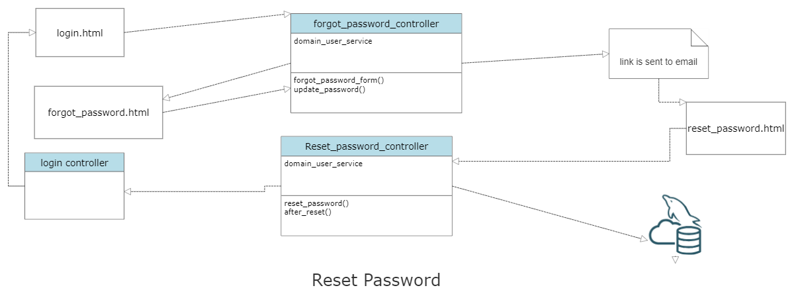
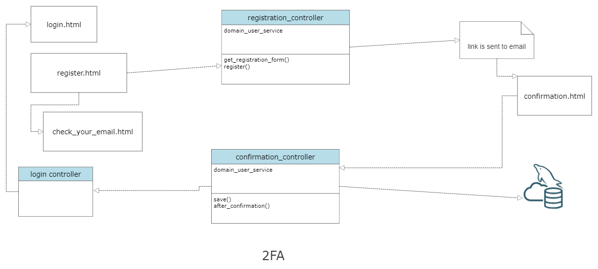

# Forum 11
# Forum Application Password Reset and 2-Factor Authentication

 

## Introduction

 

This implementation is the starting point for the Forum Application. Users cannot access any features of the application until they are logged in. To use the forum, users need to register and provide an appropriate email for 2-factor authentication. Additionally, there is an option on the login page to reset the password if the user ever forgets it.

 

This implementation is split into two sub-implementations:

 

- Password reset using authentication.
- 2-factor authentication during registration.

 

## Password Reset

 

In this implementation, the user is given an option to reset their password by clicking the "Forgot Password" link present on the login page. This link redirects the user to a verification page where the user needs to enter their email. By doing this, the user's email is fetched from the database, and a link to reset their password is sent to their email. After resetting the password, the user is redirected to the login page.

 

 

## 2-Factor Confirmation and Authentication

 

Here, the user is sent a confirmation link to their email during the registration process. The user needs to click on the link, and the confirmation will redirect them to the login page.

 

